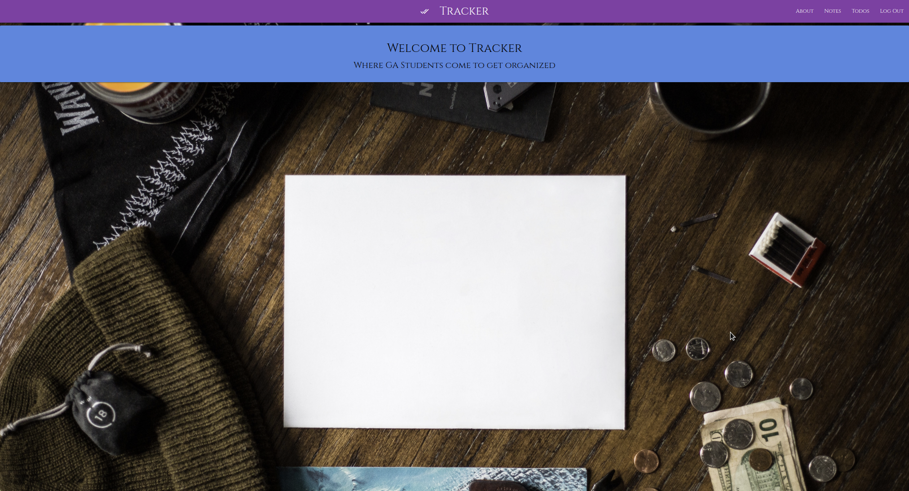
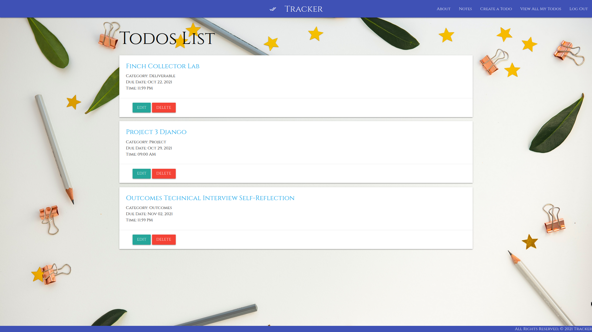
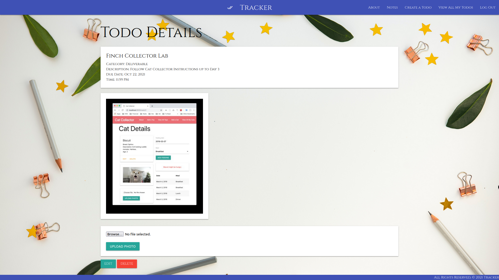
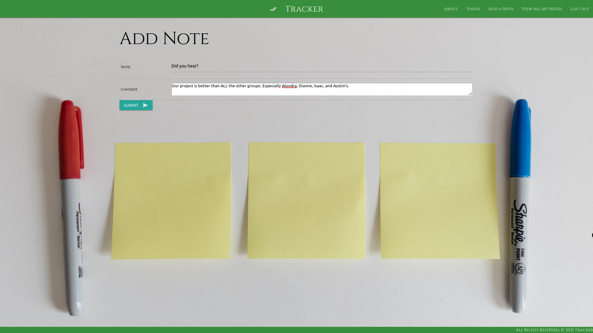

# How to Write a README for a Bootcamp Project
The README is nearly always the most overlooked and often neglected last part of a project. Yet, it is a critical part of any portfolio for an employer to get an idea of what kind of work you produce. Thus, today we're going to take a quick look at what a README should and shouldn't look like. 

*If you're just looking for an empty formatted README template, you can find it [here](TemplateREADME.md).

| Markdown | Screenshot | Markdown | Screenshot|
|----------| -----------|----------|-----------|
 | <h3 align="center"></h3> |  | <h3 align="center"></h3> | <h3 align="center"></h3>
 | <h3 align="center">To Do List</h3> | 
 | <h3 align="center">To Do Details</h3> | 
 | <h3 align="center">Add a Note</h3> |  

