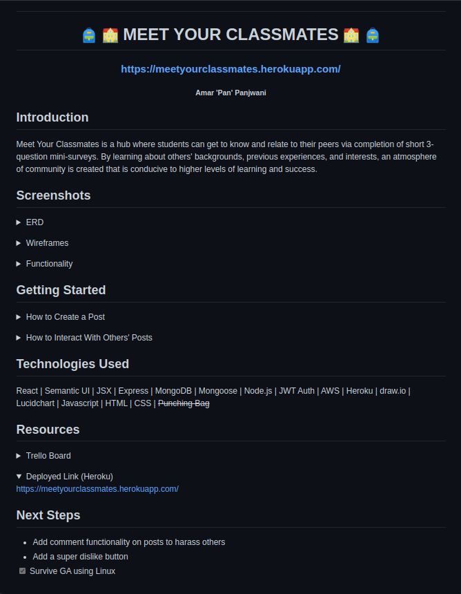
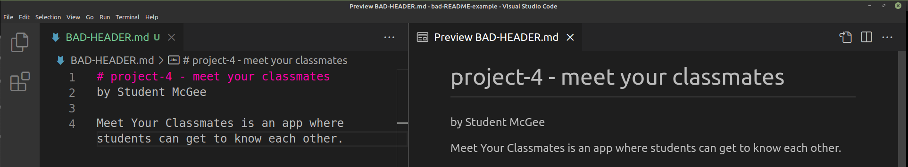
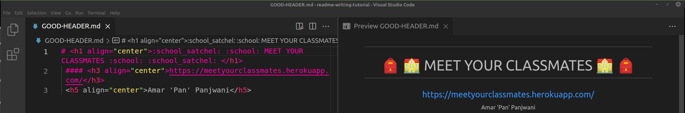

# How to Fix a README
The README is often the most overlooked and underrated aspect of a web dev project. And yet, it is what employers directly look at when assessing one's technical competency as a software engineer.

Thus, today we'll take a look at how to clean-up an existing README so that it looks presentable.

| From this:     | To this:      |
|---------------|--------------|
|  |  |

## <h2  align="center">Bad Header</h2>
     
## <h2  align="center">Good Header</h2>
 
 
|            | Instructions |
|------------|--------------|
| Note:      | Integrate styling with `<h1 align="center">` to center text |
| Note:      | Use emojis by typing in `:emojiname:` Ex. `:school:` ---> :school:

