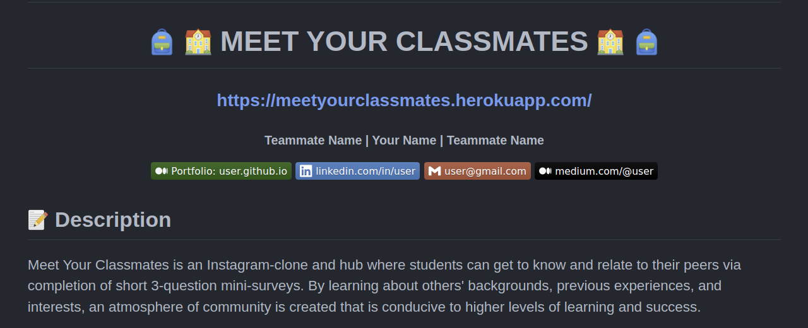
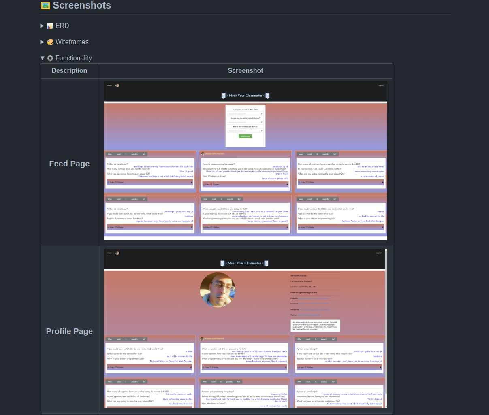
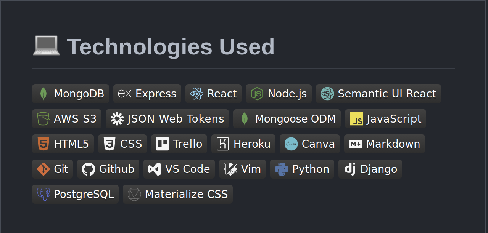
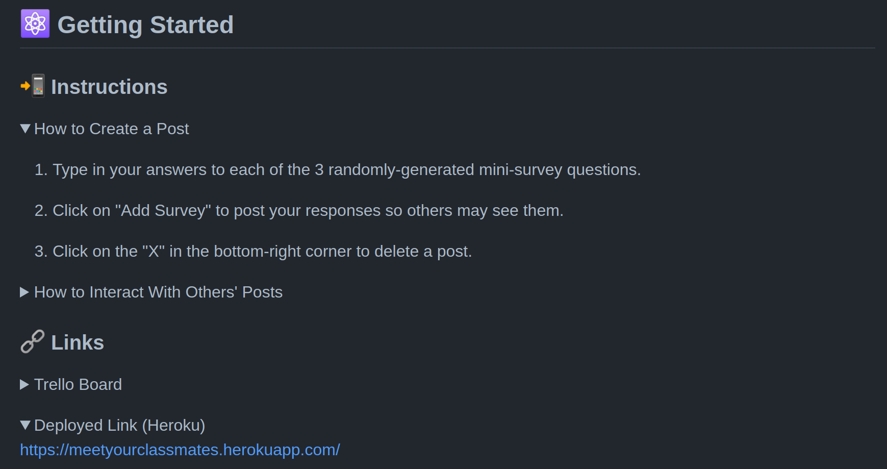
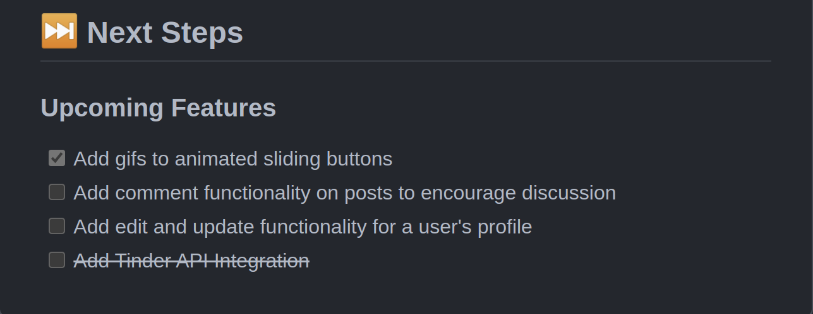
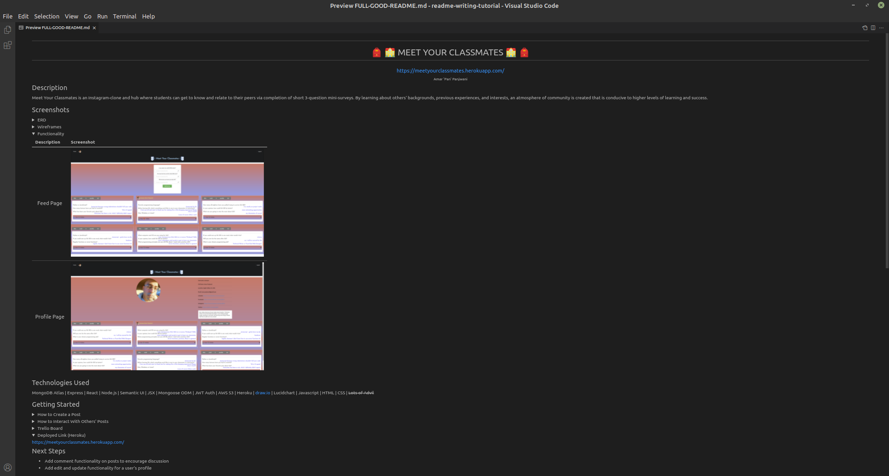
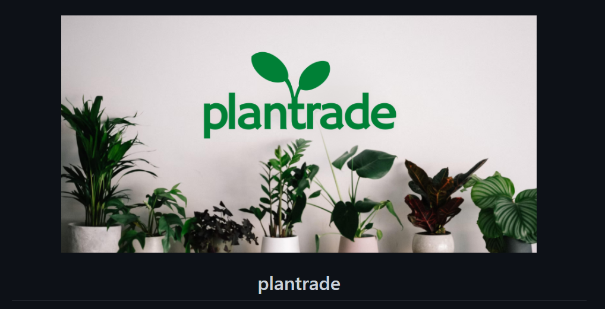
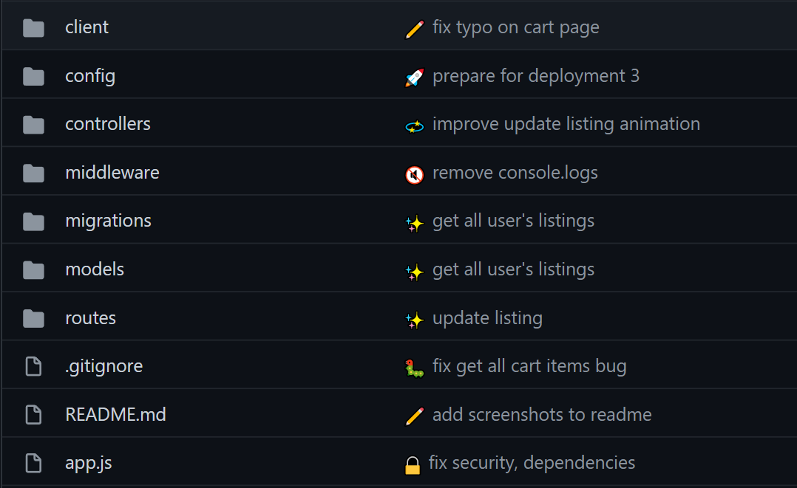

 <div align="center">
 <h1 align="center"> How to Write a General Assembly (GA) Software Engineering Immersive (SEI) Project README </h1>
<!-- ###### <h6 align="center">by</h6> -->
<h6 align="center">by<br>
   <a href="https://www.linkedin.com/in/panamruth/">Pan Amar
      </a> + <a href="https://www.linkedin.com/in/neilitalia">Neil Italia</a>      <br>
   
      
<!--    <a href="https://panamruth.github.io/portfolio" target="_blank">
     -->
   <a href="https://www.linkedin.com/in/panamruth/" target="_blank">
      
 </a>
   <a href="https://www.linkedin.com/in/neilitalia/" target="_blank">
      
 </a>    
<!--     <a href="https://neilitalia.dev/" target="_blank">
     -->
</h6>
<div align="center">
 
  <!-- <a href="mailto:amar.panjwani@gmail.com" target="_blank">
    
 </a>
 
 <a href="https://www.github.com/panamruth/" target="_blank">
      
 </a> 

  <a href="https://panamruth.github.io" target="_blank">
    
   
   <a href="https://www.linkedin.com/in/amarpan/" target="_blank">
      
 </a>    
  
 <a href="https://medium.com/@amarpan">
    
 </a> -->
   
 [](https://github.com/panamruth/readme-writing-tutorial) 

</div>
<!-- <hr /> -->
<p>
Thus tutorial describes how to easily write a GA SEI Project README in Markdown and HTML via copy and pastable code snippets.
 <!-- Writing project documentation in the form of a README is typically the last thing any GA SEI student wants to do, especially after a long and exhausting project week. -->
</p>

<p>
<!-- Thus, today we'll provide you with the copy and paste-able code to quickly and easily set up a README that will impress your classmates, instructors, and potential employers. -->
</p>


<!-- <hr /> -->
<h2  align="center"><u>Header & Description</u></h2>

<div align="center"> 
  
</div>

```html
<div align="center">
   <h1>:school_satchel: :school: MEET YOUR CLASSMATES :school: :school_satchel: </h1>
   <h3>https://meetyourclassmates.herokuapp.com/</h3>
   <h5>Teammate Name | Your Name | Teammate Name </h5>`                             
   <a href="https://yourportfoliolink.com" target="_blank">
      
   </a>
   <a href="https://www.linkedin.com/in/user/" target="_blank">
      
   </a> 
   <a href="mailto:user@gmail.com" target="_blank">
      
   </a>
   <a href="https://medium.com/@user">
      
   </a>
</div>

<h1>:pencil: Description</h1>
<p>Meet Your Classmates is an Instagram-clone and hub where students can get to know and relate to their peers via completion of short 3-question mini-surveys. By learning about others' backgrounds, previous experiences, and interests, an atmosphere of community is created that is conducive to higher levels of learning and success.</p>
```
<div align="center">

|            | Instructions |
|------------|--------------|
| Note:      | Integrate styling with `<h1 align="center">` to center text. |
| Note:      | Add your deployed link directly to the top here - many users won't scroll all the way down to find it.
| Note:      | Use emojis by typing in `:emojiname:` Ex. `:school:` ---> :school:
|         | While emojis show automatically on GitHub, to see them on VS Code one needs to install an extension like [Markdown Emoji](https://marketplace.visualstudio.com/items?itemName=bierner.markdown-emoji).
|            | Check out [ this full list of available GitHub emojis](https://github.com/ikatyang/emoji-cheat-sheet/blob/master/README.md).
<!-- | Note:      | Each `#` stands for a header of that number in HTML. | 
|            | Ex. `#` is equivalent to `<h1>` |
|            | Ex. `######` is equivalent to `<h6>`| -->   

</div>


<hr>

<h2  align="center"><u>Screenshots</u></h2>
<div align="center"> 
      
</div>

```html
<details>
<summary> :bar_chart: ERD</summary>
| Description | Screenshot |
|------------ | ------------|
| <h3 align="center">ERD</h3> |  |
</details>

<details>
<summary> :art: Wireframes</summary>
| Description | Screenshot |
|------------ | ------------|
| <h3 align="center">Home Page</h3> | 
| <h3 align="center">Profile Page</h3> |  |
</details>

<details open>
<summary> :gear: Functionality</summary>
| Description | Screenshot |
|------------ | ------------|
| <h3 align="center">Feed Page</h3> |  |
| <h3 align="center">Profile Page</h3> |  |
</details>
```   

<div align="center">

|            | Instructions |
|------------|--------------|
| Note:      | To set up a  table, use: |
|            | `\| Description \| Screenshot\|` |
|            |`\|-------------\|-----------\|`|
|            |`\|   caption   \|   image   \|`|
| Note:      | Whatever is placed in between `<details></details>` will be hidden beneath a closed drop-down menu, until its arrow is clicked on. The title for this should be placed in between `<summary></summary>`. 
| Note:      | To have a drop-down menu display by default without the user having to click it, add the word 'open' to the details tag.
|            |Ex. `<details>`  -->  `<details open>` 
| Note:      |Image dimensions can also be resized by specifying width and height.| 
|            |Ex. ``| 

<hr>

<h2  align="center"><u>Technologies Used</u></h2>  

<div align="center"> 
   
</div>

```markdown
## :computer: Technologies Used


 


 


 


 
```
   

|            | Instructions |
|------------|--------------|
| Note:      | Additional custom badges can be found at [the shields.io website.](https://shields.io/)
| Note:      | For a list of more colorful badges, [check out this repository.](https://github.com/alexandresanlim/Badges4-README.md-Profile)
<!-- | Note:      | If you'd rather note use badges (or can't find applicable ones), separate technologies in the following format: | 
|            | Ex. MongoDB|  ***figure out how to cancel out | character -->


<hr>

<h2  align="center"><u>Getting Started</u></h2>

<div align="center"> 
   
</div>

```html
<h2> :atom_symbol: Getting Started </h2>

<h3> :calling: Instructions </h3>
<details open>
<summary>How to Create a Post</summary>
<ol>
<li>Type in your answers to each of the 3 randomly-generated mini-survey questions.</li>
<li>Click on "Add Survey" to post your responses so others may see them.</li>
<li>Click on the "X" in the bottom-right corner to delete a post.</li>
</ol>
</details>

<details>
<summary>How to Interact With Others' Posts</summary>
<ol>
<li>Posts may be "liked" or "disliked" by clicking on the thumbs up or down button on their card.</li>
<li>To reveal the author of a post, hover over the "Who could it possibly be?" button.</li>
<li>To see more posts by the same user, click on the revealed username and profile picture.</li>
</ol>
</details>

<details>
<h3> :link: Links </h3>
<summary>Trello Board</summary>   
<a href="https://trello.com/b/x4ViComX/meet-your-classmates-project-4">https://trello.com/b/x4ViComX/meet-your-classmates-project-4</a>   
</details>

<details open>   
<summary>Deployed Link (Heroku)</summary>
<a href="https://meetyourclassmates.herokuapp.com/">https://meetyourclassmates.herokuapp.com/</a>
</details>
```

|            | Instructions |
|------------|--------------|
| Note:      | Use numbered lists as opposed to lengthy paragraphs to make sure this section is easily readable.
| Note:      | Put your links in more drop-down menus using `<details open>` and `<summary>`.
| Note:      | Try to choose something simple and memorable when choosing your Heroku URL / link name.

<hr>

<h2  align="center"><u>Next Steps</u></h2>

<div align="center"> 
    
</div>

```markdown
## :fast_forward: Next Steps   

### Upcoming Features

- [X] Add gifs to animated sliding buttons   

- [ ] Add comment functionality on posts to encourage discussion   

- [ ] Add edit and update functionality for a user's profile  

- [ ] ~~Add Tinder API Integration~~
```

|            | Instructions |
|------------|--------------|
| Note:      | Try to avoid using the word "icebox", as most non-technical users probably won't know what this means.
| Note:      | Use bullet points rather than paragraphs to make it immediately clear what each new feature would be.

<hr>

<h2 align="center"><u>The Final Product</u></h2>


<div align="center">
   
</div>

<!-- <h4>Today we learned how to convert an average README into one that instantly catches the eyes of employers.</h4>
<h4>Despite not being able to use proper CSS to change colors and styles, we can actually add a lot of customization and fine-tuning with the right Markdown shortcuts.</h4> -->

<hr>

<h1 align="center">Optional Additions</h1>
<h2 align="center">Header Banner</h2>

<div align="center"> 
    
</div>

```html
<div align="center">
   
   <h1 align="center">plantrade</h1>
</div>
```

|       | Instructions |
|-------|--------------|
| Note: | Royalty-free stock photos can be found on [Pexels](https://www.pexels.com/), [Pixabay](https://pixabay.com/), or [Unsplash](https://unsplash.com/). |
| Note: | Free photo editing tools like [Photopea](https://www.photopea.com/) can streamline the editing process with their ability to import images from URLs and export images directly into [imgur](https://imgur.com/). |

<hr>

<h2 align="center">Emoji Commits</h2>

<div align="center"> 
    
</div>

```console
git commit -m ":pencil2: fix typo on cart page"
```

|       | Instructions |
|-------|--------------|
| Note: | GitHub-friendly commit emojis can be found on [gitmoji](https://gitmoji.dev/). |

<hr>

<h2 align="center">Horizontal Image Scroll (Carousel) Hack</h2>

<div align="center"> 
    
</div>

```html
<pre>
  
  
  
  
  
</pre>
```

|       | Instructions |
|-------|--------------|
| Note: | This works best with images of similar heights. |

<div >
<h2> Full README Examples </h2>

</details>
 </h5>
 <details open>
<summary>   
Pan Amar - GA SEI Nov '21 - Los Angeles, CA (Apple Valley)   
</summary>
<h4> 

https://github.com/amarpan/meet-your-classmates

</h4>
</details>


<details open>
<summary>   
Neil Italia - GA SEI Oct '21 - Dallas, TX (McKinney / Frisco)   
</summary>
<h4> 

https://github.com/neilitalia/ilovehue 

https://github.com/neilitalia/plantrade

https://github.com/neilitalia/spacex-flights


</h4>

## Further Reading

|       | Instructions |
|-------|--------------|
| Note: | For a quick review on README formatting, check out [this no-nonsense Markdown tutorial](https://www.markdowntutorial.com/).
| Note: | Read through the [official GitHub-flavored Markdown documentation](https://github.github.com/gfm/) for further reference.
 
 ## Future Updates 
- [x] Add contributions
- [x] Add examples from other GA students
- [x] Add code samples
- [x] Add horizontally-scrolling images how-to
- [ ] Add table of contents
- [x] Add technologies used buttons for everything learned in GA SEI
- [x] Add 'Further Reading' section with links to Markdown tutorials and documentation
 
## Contributions
 
   
<details>
<summary>Pan Amar - GA SEI Nov '21 - Los Angeles, CA (Apple Valley) - Tech Support at Summit Medical</summary>
      <h4>
      Conception, Writing, Screenshots, Organization, Code Instructions / Explanations, Search Engine Optimization, Design, Social Media Preview Banner Creation, Interviewing Other Engineers
   </h4>
   </details>
 
<details>
<summary>Neil Italia - GA SEI Oct '21 - Dallas, TX (McKinney / Frisco) </summary>
<h4> UX / UI, Code Samples, Header Banner, Emoji Commits, Carousel Horizontally Scrolling Images Slider</h4>
</details>

<details>
<summary>Olivia Emery - GA SEI Oct '15 - San Francisco, CA (Mountain View) - Technical Writer @ Google</summary>
<h4> Editing, Suggestions for Clarity of Writing</h4>
</details>


<details>
<summary>Isaac Ferraro - GA SEI Nov '21 - Seattle, WA (Bremerton)   </summary>
<h4> Suggestions, Proofreading, Editing, Quality Assurance </h4>
</details>

<details>
<summary>Miguel Urena - GA SEI Nov '21 - Los Angeles, CA (Anaheim)   </summary>
<h4> Suggestions, Graphic Design, Social Media Rich Preview Banner, Quality Assurance </h4>
</details>


