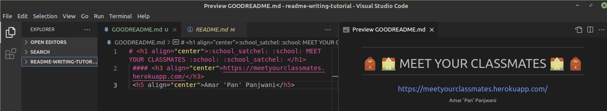

# How to Fix your README for a Bootcamp Project
The README is nearly always the most overlooked and often neglected last part of a project. Yet, it is a critical part of any portfolio for an employer to get an idea of what kind of work you produce. Thus, today we're going to take a quick look at how to clean-up a README that was clearly assembled at the very last minute. 

*If you're just looking for an empty formatted README template, you can find it [here](TemplateREADME.md).

| Title      | Screenshot |
|------------|------------|
| Good Header |   | 
| Note:      | Integrate `<h1 align="center">` to center text | test test
| Note:      | Use emojis by typing in `:emojiname:` test

