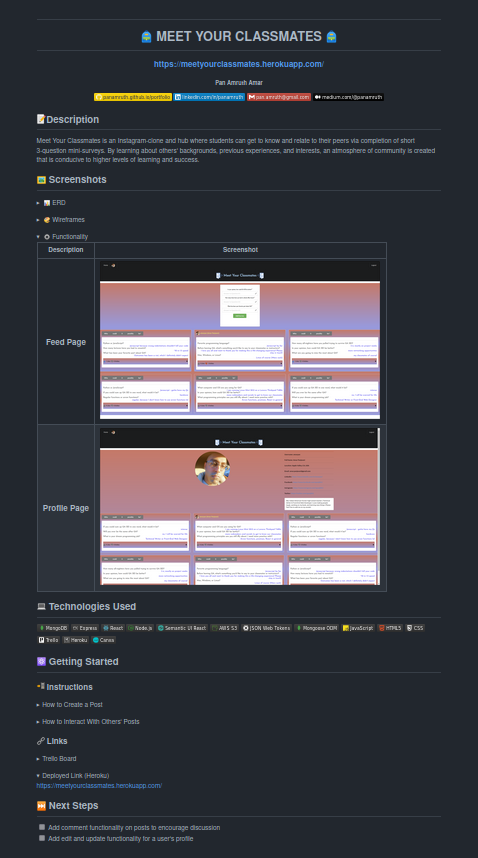

# <h1 align="center">How to Write a GA SEI Project README</h1>
<!-- ###### <h6 align="center">by</h6> -->
###### <h6 align="center"> [Professor Pan, M.Ed. - GA SEI '21](https://www.linkedin.com/in/amarpan/)</h6>

 <a href="https://amarpan.github.io" target="_blank">
    
    
  
  
 
    
    
  
  
  
  
  
  

<h4>
The README is often the most overlooked and underestimated aspect of a General Assembly SEI project, frequently left until the very last minute.
And yet, it is what employers directly look at when assessing one's technical competency as a developer. 

Thus, in today's tutorial, we'll take a look at how to write and design a GA SEI README that would make any employer blush. 

 
 </h4>

 ***This tutorial assumes you already have some semblance of a README. If you're starting from scratch, however, download my blank skeleton template [here](https://github.com/amarpan/blank-README-template/blob/main/README.md).       

***For a quick review on how to use Markdown, go [here](https://www.markdowntutorial.com/).   

## <h2  align="center">Header & Description</h2>
 
   

 |                                                                              |     
 |---------------------------------------------------------------------------------------|                      
 |                             |
 | __Code__

 `
`       

 `# <h1>:school_satchel: :school: MEET YOUR CLASSMATES :school: :school_satchel: </h1>` 

 `### <h3>https://meetyourclassmates.herokuapp.com/</h3>`                               

 `##### <h5>Teammate Name | Your Name | Teammate Name </h5>`                             
           
 `<a href="https://yourportfoliolink.com" target="_blank">`
    `
    
 `<a href="https://www.linkedin.com/in/user/" target="_blank">`
      ``
 </a> 
    
 `<a href="mailto:user@gmail.com" target="_blank">`
    ``
 </a>
    
 `<a href="https://medium.com/@user">`
    ``
 `</a>`

 `
`     

 `## :pencil: Description`

`Meet Your Classmates is an Instagram-clone and hub where students can get to know and relate to their peers via completion of short 3-question mini-surveys. By learning about others' backgrounds, previous experiences, and interests, an atmosphere of community is created that is conducive to higher levels of learning and success.`
   
 
|            | Instructions |
|------------|--------------|
| Note:      | Each `#` stands for a header of that number in HTML. | 
|            | Ex. `#` is equivalent to `<h1>` |
|            | Ex. `######` is equivalent to `<h6>`|
| Note:      | Integrate styling with `<h1 align="center">` to center text. |
| Note:      | Add your deployed link directly to the top here - many users won't scroll all the way down to find it.
| Note:      | Use emojis by typing in `:emojiname:` Ex. `:school:` ---> :school:
|         | While emojis automatically show on GitHub, to see them on VS Code one needs to install an extension like [this](https://marketplace.visualstudio.com/items?itemName=bierner.markdown-emoji).
|            | A full list of available emojis can be found [here](https://github.com/ikatyang/emoji-cheat-sheet/blob/master/README.md).

## <h2  align="center">Screenshots</h2>
    

 |                                                                              |     
 |---------------------------------------------------------------------------------------|                      
 |                       |
 | __Code__   
 
 `
`

 `
 :bar_chart: ERD
`

 `| Description | Screenshot |`

 `|------------ | ------------|`

 `| <h3 align="center">ERD</h3> | `
 
`
`

`
`

 `
 :art: Wireframes
`
 
 `| Description | Screenshot |`
 
 `|------------ | ------------|`

 `| <h3 align="center">Home Page</h3> | `

 `<h3 align="center">Profile Page</h3> | `
 
 
`
`

`
`

 `
 :gear: Functionality
`
 
 `| Description | Screenshot |`

 `|------------ | ------------|`

 `| <h3 align="center">Feed Page</h3> | `

 `| <h3 align="center">Profile Page</h3> | `
 
`
`   
       

|            | Instructions |
|------------|--------------|
| Note:      | To set up a  table, use |
|            | `\| Description \| Screenshot\|` |
|            |`\|-------------\|-----------\|`|
|            |`\|   caption   \|   image   \|`|
| Note:      | Whatever is placed in between `

` will be hidden beneath a closed drop-down menu, until its arrow is clicked on. The title for this should be placed in between `

`. 
| Note:      | To have a drop-down menu display by default without the user having to click it, add the word 'open' to the details tag.
|            |Ex. `
`  -->  `
` 
| Note:      |Image dimensions can also be resized by specifying width and height.| 
|            |Ex. ``| 

## <h2  align="center">Technologies Used</h2>  

 |                                                                              |     
 |---------------------------------------------------------------------------------------|                      
 |                        |
 | __Code__  

 `## 💻 Technologies Used`   

 ``   

 ``

`` 

``

``

``

``

``

`` 

``

``

``

``

``       
   
<!-- 
|            | Instructions |
|------------|--------------|
| Note:      | 
 -->

## <h2  align="center">Getting Started</h2>   
 
 |                                                                              |     
 |---------------------------------------------------------------------------------------|                      
 |     
                        
 __Code__  

 `## :atom_symbol: Getting Started`   

`### :calling: Instructions`   

`
`   

`
How to Create a Post
`
 
`1. Type in your answers to each of the 3` `randomly-generated mini-survey questions.`   
 
`2. Click on "Add Survey" to post your responses so` `others may see them.`
 
`3. Click on the "X" in the bottom-right corner to` `delete a post. `   

`
`   
   

`
`   

`
How to Interact With Others' Posts
`
 
`1.  Posts may be "liked" or "disliked" by clicking` `on the thumbs up or down button on their card.`
 
`2. To reveal the author of a post, hover over the` `"Who could it possibly be?" button.`
 
`3. To see more posts by the same user, click on the` `revealed username and profile picture.`

`
`   

`### :link: Links`

`
`   

`
Trello Board
`   

`<a href="https://trello.com/b/x4ViComX/meet-your-classmates-project-4">https://trello.com/b/x4ViComX/``meet-your-classmates-project-4</a>`   

`
`

`
`   

`
Deployed Link (Heroku)
`   

`<a href="https://meetyourclassmates.herokuapp.com/">https://meetyourclassmates.herokuapp.com/</a>`
`
`   

|            | Instructions |
|------------|--------------|
| Note:      | Use number lists as opposed to lengthy paragraphs to make sure this section is easily readable.
| Note:      | Put your links in more drop-down menus using `
` and `
`.
| Note:      | Try to choose something simple and memorable when choosing your Heroku URL / link name.

## <h2  align="center">Next Steps</h2>
   
 

|                                                                              |     
 |---------------------------------------------------------------------------------------|                      
 |     
                        
 __Code__

`## :fast_forward: Next Steps`   

`### Upcoming Features`

`- [X] Add gifs to animated sliding buttons`   

`- [ ] Add comment functionality on posts to encourage discussion`   

`- [ ] Add edit and update functionality for a user's profile`  

`- [ ] <s>Add Tinder API Integration </s>`
  

|            | Instructions |
|------------|--------------|
| Note:      | Try to avoid using the word "icebox", as most non-technical users probably won't know what this means.
| Note:      | Use bullet points rather than paragraphs to make it immediately clear what each new feature would be.

## <h2  align="center">The Final Product</h2>
#### <h4 align="center">(On GitHub)</h3>

     

<h4>Today we learned how to convert an average README into one that instantly catches the eyes of employers.</h4>   
 
 <h4>Despite not being able to use proper CSS to change colors and styles, we can actually add a lot of customization and fine-tuning with the right Markdown shortcuts.</h4>
 
 ## Examples

   
Neil Italia - GA SEI Oct '21 - Dallas / Fort Worth, TX   

<h4> 

https://github.com/neilitalia/ilovehue 

https://github.com/neilitalia/plantrade

https://github.com/neilitalia/spacex-flights

</h4>

 </h5>
 

   
Amar 'Pan' Panjwani - GA SEI Nov '21 - Apple Valley, CA (Los Angeles)   

<h4> 

https://github.com/amarpan/meet-your-classmates

</h4>

 
 ## Future Updates

- [x] Add Contributions
- [x] Add Examples from other GA students
- [x] Add code samples that are easy to copy and paste
 
## Contributions

Neil Italia - GA SEI Oct '21 - Dallas / Fort Worth, TX 

<h4> How to Add Horizontally-Scrolling Images (In-Progress) </h4>

Isaac Ferrero - GA SEI Nov '21 - Bremerton, WA (Seattle)   

<h4> Proofreading | Editing | Quality Assurance </h4>

Miguel Urena - GA SEI Nov '21 - Anaheim, CA (Orange County / Los Angeles)   

<h4> Quality Assurance </h4>

