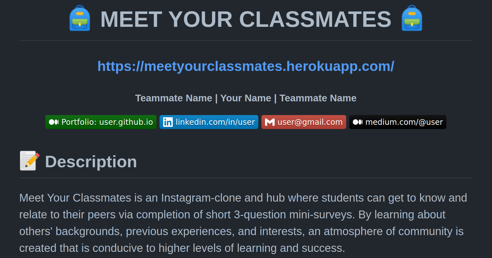
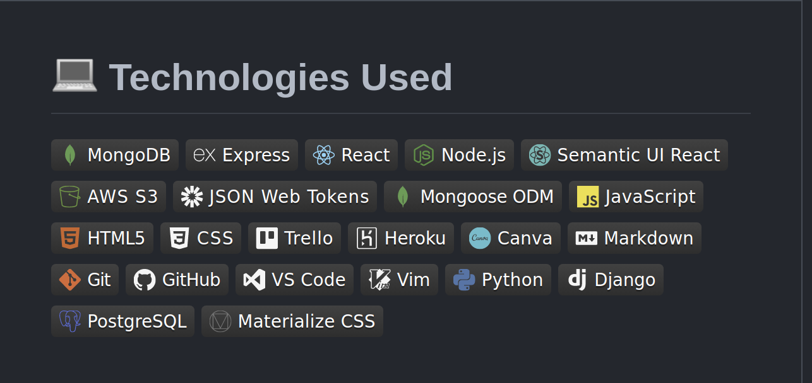

<div align="center" id="header">
 
# How to Write a README

**Written by [Professor Pan, M.Ed.](https://www.linkedin.com/in/profpan396/)** 
<br>
Sr. Instructional Associate
     
</div>
  
<div align="center" id="socialbuttons">

  [](https://profpan396.github.io)
  <br>
  [](https://www.github.com/profpan396/)
  [](https://twitter.com/profpan396)
  [](https://www.linkedin.com/in/profpan396/)
  <br>
  
  
  
  <br>
  

  ### ***If you find this tutorial helpful, please consider giving it a :star:

</div>

<div align="center" id="intro">

This tutorial describes how to write a coding bootcamp project README in HTML and GitHub Flavored Markdown in 20 minutes or less.

</div>

<div id="before-you-begin">

## Before You Begin

Complete the following steps prior to getting started:

### 1. Visit the README gold standard:
[Meet Your Classmates](https://github.com/profpan396/meet-your-classmates)

### 2. Complete the following Introduction to Markdown tutorial (10 mins):
[Markdown Tutorial](https://www.markdowntutorial.com/)

### 3. Read (skim) through the official GitHub-flavored Markdown documentation:
[GitHub Flavored Markdown Spec](https://github.github.com/gfm/)

</div>

<div id="description">

## Description

  <u>Requirements:</u> 
  1. App name
  2. What it does
  3. Optional background information</p>

| Description | Screenshot | 
|:------------:|-----------| 
| <h3>ERD</h3> |  |

  <div align="center"> 
    
  </div>
</div>

</div>

<div align="center">
<h3><strong>Copy and paste the following:</strong></h3>
</div>

  ```html
  <div align="center">
  <h1>
  :school_satchel: :school: MEET YOUR CLASSMATES :school: :school_satchel:
  </h1>

  <h3><a href="https://meetyourclassmates.herokuapp.com/">CLICK TO DEMO</a></h3>

  <h5>Your Name</h5>

  <a href="https://www.linkedin.com/in/username/" target="_blank">
  
  </a>

<h1>:pencil: Description</h1>

<p>
Meet Your Classmates is an Instagram-clone and hub where students can get to
know and relate to their peers via completion of short 3-question
mini-surveys. By learning about others' backgrounds, previous experiences, and
interests, an atmosphere of community is created that is conducive to higher
levels of learning and success.
</p>


```

<div align="center">

| Tips             |
|------------------|
| Integrate styling by using `<div align="center"></div>` to center text.                                                                                                       
| Add your deployed link directly to the top - many users won't scroll all the way down to find it.                                                                                                                                            
| Use emojis by typing in `:emojiname:` <br> Example: `:school:` ---> :school: <br> Check out [ this list of available GitHub emojis](https://github.com/ikatyang/emoji-cheat-sheet/blob/master/README.md).                                                                                                                                   
| <h3 align="center"><strong>Note:</strong></h3>**While emojis show automatically on GitHub, to see them on VS Code you need to install an extension like [Markdown Emoji](https://marketplace.visualstudio.com/items?itemName=bierner.markdown-emoji). Some emojis may also look completely different on VS Code compared to GitHub.**
</div>
</div>

<hr>

<div id="screenshots">

  <h2>Screenshots</h2>

  **Requirements**: 
  1. Screenshots of your app's landing page and any other pages of interest
  <div align="center"> 
        
  </div>
<div align="center">
<h3><strong>Copy and paste the following:</strong></h3>
</div>

```html
<details>
  <summary>:bar_chart: ERD</summary>

  | Description | Screenshot | 
  |:------------:|-----------| 
  | <h3>ERD</h3> |  |

</details>

<details>
  <summary>:art: Wireframes</summary>

  |    Description    | Screenshot | 
  |:-----------------:|-------------| 
  | <h3>Home Page</h3>|  |
  | <h3 align="center">Profile Page</h3> |  |
</details>

<details open>
  <summary>:gear: Functionality</summary>

  |   Description | Screenshot | 
  |:-------------:| -----------|
  | <h3>Feed Page</h3> |  |
  | <h3 align="center">Profile Page</h3> |  |
</details>
```
| Tips 
|--------------
| To set up a table use:
| `Description \| Screenshot \|`
| `:----------:\|------------\|`
| `caption    \|    image   \|`
| Whatever is placed in between `<details></details>` will be hidden beneath a closed drop-down menu, until its arrow is clicked on. The title for this should be placed in between `<summary></summary>`.
| To have a drop-down menu display by default without the user having to click it, add the word 'open' to the details tag. <br> <u><strong>Example:<strong></u> `<details>` --> `<details open>`                                                                                                      
| Image dimensions can also be resized by specifying width and height. <br> <u><strong>Example:<strong></u> ``                                                                                                                                                                                                                                                        |
</div>
<hr>

<div id="technologies-used">

<h2>Technologies Used</h2>


**Requirements**: List of the technologies used.

<div align="center"> 
   
</div>
</div>

<div align="center">
<h3><strong>Copy and paste the following:</strong></h3>
</div>

```markdown
## :computer: Technologies Used
A screenshot of your app's landing page and any other screenshots of interest.


```

   <div align="center">

| Tips |  |
|--------------|--|
| Note: | Additional custom badges can be found at [the shields.io website.](https://shields.io/)                                        |
| Note: | For a list of more colorful badges, [check out this repository.](https://github.com/alexandresanlim/Badges4-README.md-Profile) |

</div>
</div>

<hr>

<h2>Getting Started</h2>

**Requirements**: 
- A link to the deployed app
- A link to the Trello board used for the project's planning that includes user stories, wireframes, and ERD

<div align="center"> 
   
</div>

<div align="center">
<h3><strong>Copy and paste the following:</strong></h3>
</div>

```html
<h2>:fire: Getting Started</h2>

<h3>:calling: Instructions</h3>
<details open>
  <summary>How to Create a Post</summary>
  <ol>
    <li>
      Type in your answers to each of the 3 randomly-generated mini-survey
      questions.
    </li>
    <li>
      Click on "Add Survey" to post your responses so others may see them.
    </li>
    <li>Click on the "X" in the bottom-right corner to delete a post.</li>
  </ol>
</details>

<details>
  <summary>How to Interact With Others' Posts</summary>
  <ol>
    <li>
      Posts may be "liked" or "disliked" by clicking on the thumbs up or down
      button on their card.
    </li>
    <li>
      To reveal the author of a post, hover over the "Who could it possibly be?"
      button.
    </li>
    <li>
      To see more posts by the same user, click on the revealed username and
      profile picture.
    </li>
  </ol>
</details>

<details>
  <h3>:link: Links</h3>
  <summary>Trello Board</summary>
  <a href="https://trello.com/b/x4ViComX/meet-your-classmates-project-4"
    >https://trello.com/b/x4ViComX/meet-your-classmates-project-4</a
  >
</details>

<details open>
  <summary>Deployed Link (Heroku)</summary>
  <a href="https://meetyourclassmates.herokuapp.com/"
    >https://meetyourclassmates.herokuapp.com/</a
  >
</details>
```

<div align="center">

|       | Tips                                                                                      |
| ----- | ------------------------------------------------------------------------------------------------- |
| Note: | Use numbered lists as opposed to lengthy paragraphs to make sure this section is easily readable. |
| Note: | Put your links in more drop-down menus using `<details open>` and `<summary>`.                    |
| Note: | Try to choose something simple and memorable when choosing your Heroku URL / link name.           |

<hr>

</div>

<h2>Next Steps</h2>

**Requirements** : Planned future enhancements (icebox items).


<div align="center"> 
    
</div>

</div>

<div align="center">
<h3><strong>Copy and paste the following:</strong></h3>

</div>

```markdown
## :fast_forward: Next Steps

### Upcoming Features

- [x] Add gifs to animated sliding buttons

- [ ] Add comment functionality on posts to encourage discussion

- [ ] Add edit and update functionality for a user's profile

- [ ] ~~Add Tinder API Integration~~
```

<div align="center">

|       | Tips                                                                                           |
| ----- | ------------------------------------------------------------------------------------------------------ |
| Note: | Avoid using the word `icebox`, as most non-technical users probably won't know what this means. |
| Note: | Use bullet points rather than paragraphs to make it immediately clear what each new feature would be.  |

<hr>

</div>

<h2>The Final Product</h2>

<div align="center">
   
</div>

<!-- <h4>Today we learned how to convert an average README into one that instantly catches the eyes of employers.</h4>
<h4>Despite not being able to use proper CSS to change colors and styles, we can actually add a lot of customization and fine-tuning with the right Markdown shortcuts.</h4> -->

<hr>

<h1>Optional Additions</h1>
<h2>Header Banner</h2>

<div align="center"> 
    
</div>

</div>

<div align="center">
<h3><strong>Copy and paste the following:</strong></h3>

</div>

```html
<div align="center">
  
  <h1 align="center">plantrade</h1>
</div>
```

<div align="center">

| Tips: |  |
|---------------|--|
| Note: | Royalty-free stock photos can be found on [Pexels](https://www.pexels.com/), [Pixabay](https://pixabay.com/), or [Unsplash](https://unsplash.com/).                                                               |
| Note: | Free photo editing tools like [Photopea](https://www.photopea.com/) can streamline the editing process with their ability to import images from URLs and export images directly into [imgur](https://imgur.com/). |

<hr>

</div>

<h2>Emoji Commits</h2>

<div align="center"> 
    
</div>

</div>

<div align="center">
<h3><strong>Copy and paste the following:</strong></h3>

</div>

```console
git commit -m ":pencil2: fix typo on cart page"
```

<div align="center">

|       | Tips                                                                   |
| ----- | ------------------------------------------------------------------------------ |
| Note: | GitHub-friendly commit emojis can be found on [gitmoji](https://gitmoji.dev/). |

<hr>

</div>


<h2>Horizontal Image Scroll (Carousel)</h2>

<div align="center"> 
    
</div>

</div>

<div align="center">
<h3><strong>Copy and paste the following:</strong></h3>

</div>

```html
<pre>
  
  
  
  
  
</pre>
```

<div align="center"> 

|       | Tips                                    |
| ----- | ----------------------------------------------- |
| Note: | This works best with images of similar heights. |

</div>
<div>
<hr >
<div align="center">
<h2 align="center"> README <br> HALL OF FAME <br> :trophy::star2::trophy: </h2>
</div>
</details>
 </h5>

<div align="center">

 | Designer | Project | School | Location | Date
 |:--------:|:-------:|:------:|:--------:|:---:
 | [Nisha Yadav](https://www.linkedin.com/in/nisha-yadav09/) | [Minesweeper](https://github.com/nisha-yadav09/minesweeper) | General Assembly | Denver, Colorado | Apr '22 
 | [Ronald Portalatin Jr.](https://www.linkedin.com/in/ronaldportalatinjr/) | [Blackjack](https://github.com/coltonsaywhatt/GA-Blackjack-Project) | General Assembly | Lakeland, Florida | Apr '22 
 | [Jordan-Christopher Garcia](https://www.linkedin.com/in/jctgarcia20/) | [Shoe Collector](https://github.com/jctgarcia20/shoe-collector) | General Assembly | Seattle, Washington | May '22 
 | [Stevie Militello](https://www.linkedin.com/in/stevie-militello/) | [Tavern Brawl](https://github.com/steviemilitello/tavern-brawl) | General Assembly | Boston, Massachusetts | May '22 
 | [Dani Diaz](https://www.linkedin.com/in/danidiaz8/) | [Dino Amigo](https://github.com/dani-diaz/dino-amigo2) | General Assembly | El Cerrito, California | Jun '22
 | [Illerdon Ballinger](https://www.linkedin.com/in/ilerdon-ballinger/) | [Turbo Disco](https://github.com/iballinger/turbo-octo-disco) | General Assembly | San Mateo, California | Jun '22 
 | [Joseph Caputo](https://www.linkedin.com/in/josephcaputo44/) | [Vinyl Stash](https://github.com/jcaputo44/vinyl-stash) | General Assembly | San Diego, California | Jun '22 
 | [Maroof Khan](https://www.linkedin.com/in/maroofkhn/) | [Crypto Sniffer](https://github.com/MaroofKhan1/CryptoSniffer) | General Assembly | Minneapolis, Minnesota| Jun '22 
 | [Matthew Suzuki](https://www.linkedin.com/in/mattsuzuki/) | [Community Market](https://github.com/mattsuzuki/community-market) | General Assembly | Los Angeles, CA | Jun '22 
 | [Parker Samuels](https://www.linkedin.com/in/parkersamuels/) | [Checkers](https://github.com/prkrsamuels7/checkers) | General Assembly | Detroit, Michigan | Jun '22 
 | [Roger Davila](https://www.linkedin.com/in/roger-davila/) | [Solitaire](https://github.com/Toastito/solitaire) | General Assembly | San Francisco, California | Jun '22 
 | [Sophia Best](https://www.linkedin.com/in/sophiabest/) | [ThreadUp](https://github.com/sophiabest/ecommerce) | General Assembly | Louiseville, Kentucky | Jun '22 
 | [Joba Aladeselu](https://www.linkedin.com/in/joba-a-ja11/) | [Oja](https://github.com/jobaa11/product-design-app) | General Assembly | Los Angeles, California| Sep '22 


 


 </div>

<!-- <details open>
<summary>
Neil Italia - GA SEI Oct '21 - Dallas, TX (McKinney / Frisco)
</summary>
<h4>

https://github.com/neilitalia/ilovehue

https://github.com/neilitalia/plantrade

https://github.com/neilitalia/spacex-flights


</h4> -->

<div align="center">


 <!-- ## Future Updates 

 </div>
 </div>

- [x] Add contributions
- [x] Add examples from other GA students
- [x] Add code samples
- [x] Add horizontally-scrolling images how-to
- [ ] Add table of contents
- [x] Add technologies used buttons for everything learned in GA SEI
- [x] Add 'Further Reading' section with links to Markdown tutorials and documentation -->

<div align="center">

<h2 align="center"> More Tutorials from Professor Pan </h2>

 [How to Create a GitHub Profile](https://github.com/profpan396/how-to-create-a-github-profile)

 [How to Change Themes in Z Shell](https://github.com/profpan396/how-to-change-themes-in-zshell)

 [How to Use the Vim Text Editor in the Terminal](https://github.com/profpan396/how-to-use-the-vim-text-editor)


<h2 align="center"> Contributions </h2>
 
|  Name | Title | Contribution |
|:------|:-----:|:------------:|
| <a href="https://www.linkedin.com/in/profpan396">Amar Pan, M.Ed. <br>:india:</a> | README KING <br> :crown: <br><br> Sr. Instructional Associate @ General Assembly <br><br> Technical Writer @ <a href="https://www.linode.com/docs/guides/">Linode</a>  <br><br> House Pan Founder  | Writing <br> :pencil2:
| <a href="https://www.linkedin.com/in/neilitalia/">Neil Italia</a> <br>:philippines:  | User Interface Developer @ Lennox International | UI <br> :paintbrush:
| <a href="https://www.linkedin.com/in/olivia-emery/">Olivia Emery</a><br>:crown: | Technical Writer @ Google | Editing <br>:pen:
| <a href="https://www.linkedin.com/in/jimclarkfullstack/">Jim Clarke <br>:goat:</a> | Distinguished Global Lead Instructor @ General Assembly | Teaching <br> :man_teacher:
| <a href="https://www.linkedin.com/in/skimalee/">Stephanie Lee, M.Ed. <br>🇰🇷</a> | Sr. Instructional Associate @ General Assembly <br><br> House Lee Founder | Support <br>:woman_teacher:
| <a href="https://www.linkedin.com/in/mariorrecinos/">Mario Recinos <br>:guatemala:</a> | Sr. Instructional Associate @ General Assembly <br><br> Career Coach @ <a href="https://www.careerkarma.com">Career Karma</a> <br><br> House Rec Founder | Support <br>:teacher:


 
### ***If you found this tutorial helpful, please consider giving it a :star:

Copyright :copyright: 2021-2022 Pan You Can
 
 </div>
 </div>
  
<!-- <details>
<summary>Amar Panjwani - GA SEI <br> Nov '21 - Los Angeles, CA (Apple Valley) - Tech Support at Summit Medical</summary>
      <h4>
      Conception, Writing, Screenshots, Organization, Code Instructions / Explanations, Search Engine Optimization, Design, Social Media Preview Banner Creation, Interviewing Other Engineers
   </h4>
   </details>

<details>
<summary> (McKinney / Frisco) </summary>
<h4> UX / UI, Code Samples, Header Banner, Emoji Commits, Carousel Horizontally Scrolling Images Slider</h4>
</details>

<details>
<summary>Olivia Emery - GA SEI Oct '15 - San Francisco, CA (Mountain View) - Technical Writer @ Google</summary>
<h4> Editing, Suggestions for Clarity of Writing</h4>
</details>


<details>
<summary>Isaac Ferraro - GA SEI Nov '21 - Seattle, WA (Bremerton)   </summary>
<h4> Suggestions, Proofreading, Editing, Quality Assurance </h4>
</details>

<details>
<summary>Miguel Urena - GA SEI Nov '21 - Los Angeles, CA (Anaheim)   </summary>
<h4> Suggestions, Graphic Design, Social Media Rich Preview Banner, Quality Assurance </h4>
</details> -->
