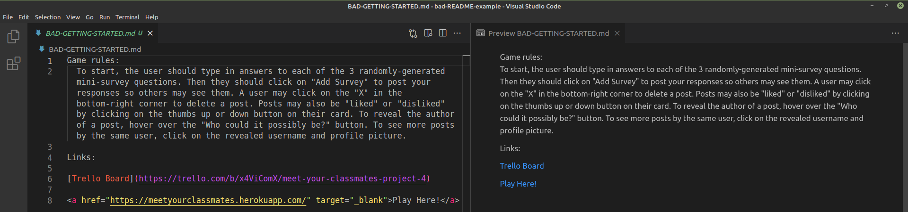
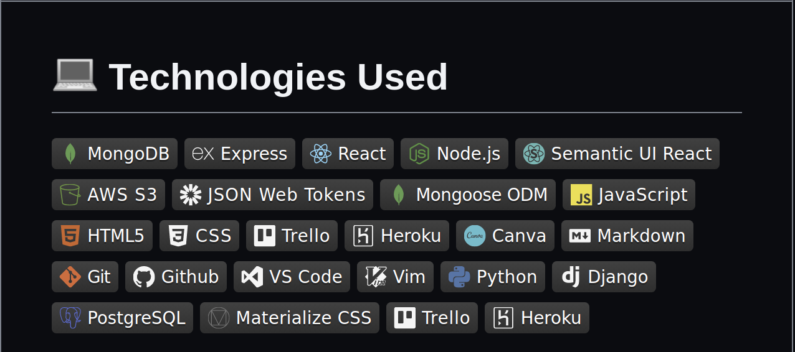
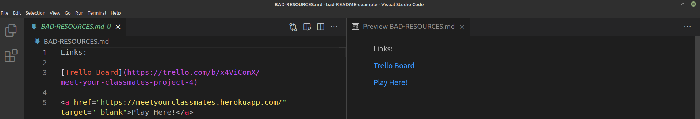
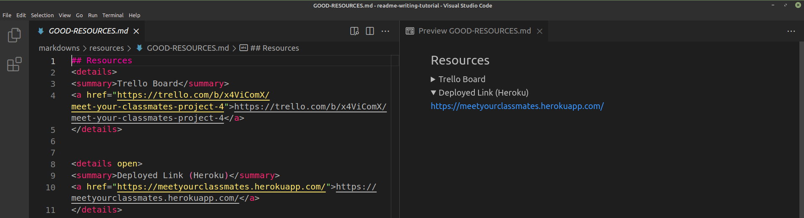

# How to Fix a README
The README is often the most overlooked and underrated aspect of a web dev project. And yet, it is what employers directly look at when assessing one's technical competency as a software engineer.

Thus, today we'll take a look at how to clean-up an existing README so that it looks presentable.   

***This tutorial assumes you already have some semblance of a README. If you're starting from scratch, however, download my template [here](). 

| From this:     | To this:      |
|---------------|--------------|
|  |  |

## <h2  align="center">Header - Bad vs Good</h2>
     
 
 
 
|            | Instructions |
|------------|--------------|
| Note:      | Integrate styling with `<h1 align="center">` to center text |
| Note:      | Use emojis by typing in `:emojiname:` Ex. `:school:` ---> :school:

## <h2  align="center">Screenshots - Bad vs Good</h2>
     
 

|            | Instructions |
|------------|--------------|
| Note:      | To set up a  table, use `\| Description \| Screenshot \| ` followed by `\|---\|---\|` followed by `\| <caption> \| <image> \|`
| Note:      | Whatever is placed in between `

 ` will be put into a closed drop-down menu. The title for this should be placed in between `

` 
| Note:      | To have a drop-down menu display by default without the user having to click it, add `
` 

## <h2  align="center">Getting Started - Bad vs Good</h2>
     
     

|            | Instructions |
|------------|--------------|
| Note:      | Use number lists as opposed to lengthy paragraphs to make sure this section is easily readable

## <h2  align="center">Technologies Used - Bad vs Good</h2>
     
     

|            | Instructions |
|------------|--------------|
| Note:      | Separate each technology used with a `\|` to avoid making your README unnecessarily long 

## <h2  align="center">Resources - Bad vs Good</h2>
     
     

|            | Instructions |
|------------|--------------|
| Note:      | Put your links in more drop-down menus using `
` and `
`
| Note:      | Try to choose something simple and memorable when choosing your URL / link name

## <h2  align="center">Next Steps - Bad vs Good</h2>
     
     

|            | Instructions |
|------------|--------------|
| Note:      | Try to avoid using the word "icebox", as most non-technical users won't know what this means
| Note:      | Avoid paragraphs and instead use bullet points to make it immediately clear what each new feature would be
